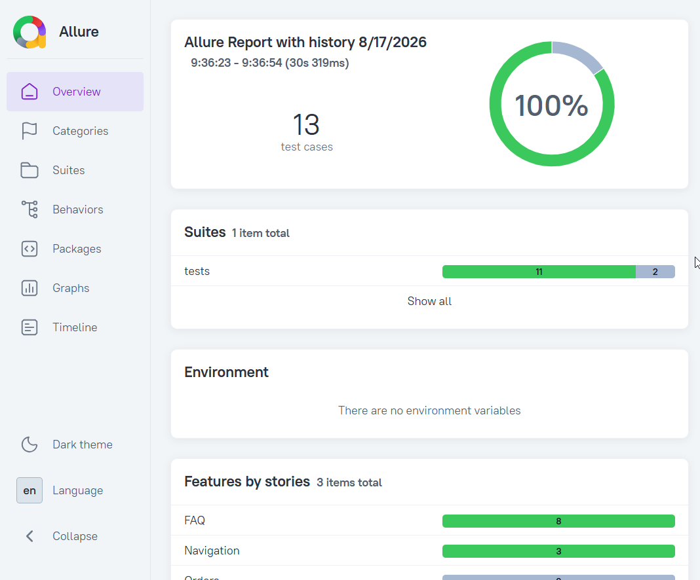

# 🛴 Яндекс Самокат — API / UI автотесты

Проект автоматизации тестирования сервиса аренды самокатов  
[Яндекс Самокат](https://qa-scooter.praktikum-services.ru/)


### Технологии
- Python
- Pytest
- Allure
- Docker
- Playwright
---

## 📦 Запуск тестов в docker-контейнере
```
docker-compose up — собрать и запустить тесты
docker-compose up --build — пересобрать образ и запустить тесты (в случае изменений в коде)
docker-compose down — остановить контейнеры
docker-compose run tests --browser chromium — запустить в конкретном браузере (по умолчанию chromium)
docker-compose run tests --env stage - запустить тесты в конкретном окружении (по умолчанию dev)
docker-compose run tests -m smoke — запустить smoke-тесты
```


## 📦 Локальный запуск тестов в IDE

#### 1. Подготовка окружения и установка зависимостей 
```bash
.\.venv\Scripts\activate - шаг 1. Активация виртуального окружения. Выполнять в корне проекта
uv sync - шаг 2. Установка зависимостей
pre-commit install - шаг 3. Скачивание хуков для применения конфигурации линтера к каждому коммиту. Новый код будет гарантированно форматирован согласно стандартам проекта
uv run playwright install - шаг 4. Установка браузеров (Chromium, Firefox, WebKit)
```

#### 2. Запуск тестов
```bash
# Запуск в выбранном окружении (dev / stage)
pytest --env=dev

# Запуск в выбранном браузере (chromium / firefox / webkit)
pytest --browser=firefox
```

## Генерация Allure-отчёта
После запуска тестов любыми указанными выше способами результаты будут доступны вне контейнера в папке /allure-results
``` bash
# Просмотр отчёта
allure serve

# Генерация в папку reports
allure generate allure-results -o reports --clean
```

Пример Allure-отчёта:



## Запуск тестов в CI/CD Pipeline
CI/CD Pipeline запускается вручную с выбором браузера, набора тестов и окружения.
Генерирует Allure-отчёт и публикует его на GitHub Pages. 
Отчёт доступен даже при падении тестов.